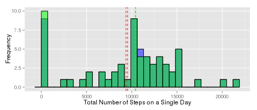

Reproducible Research Assignment 1
==================================

For this assignment I perform data analysis on the output of an activity
monitoring device of one person over the course of 61 days.

### The Source Raw Data
The data for these analyses are obtained from the URL: <https://d396qusza40orc.cloudfront.net/repdata%2Fdata%2Factivity.zip> on August 16, 2014. The checksum of the file used for this report is `"61e0c1f8c4a736ff1ab0f8863344b301"`.

```r
# Downloading the source raw data and verifying its authenticity
library(tools)
if (!file.exists('activity.zip')) {
  download.file('https://d396qusza40orc.cloudfront.net/repdata%2Fdata%2Factivity.zip', 'activity.zip', method="curl")
  if (md5sum('activity.zip') != "61e0c1f8c4a736ff1ab0f8863344b301") {
    warning("The file downloaded differs from the original file on which the report's analysis were performed.")
  }
}
```

### Loading and Preprocessing the Raw Data
The data is a Zip-compressed CSV file in its raw format. I load it into
memory in order to perform my analysis first.

```r
data <- read.csv(unz('activity.zip', 'activity.csv'))
data$date <- as.Date(data$date)
str(data)
```

```
## 'data.frame':	17568 obs. of  3 variables:
##  $ steps   : int  NA NA NA NA NA NA NA NA NA NA ...
##  $ date    : Date, format: "2012-10-01" "2012-10-01" ...
##  $ interval: int  0 5 10 15 20 25 30 35 40 45 ...
```

### What is mean total number of steps taken per day?
The following is a histogram of the number of steps taken per day over
the monitoring period.

```r
library(reshape2)
library(ggplot2)
molten <- melt(data, id.vars=c('date'))
steps.per.date <- dcast(molten, date ~ variable, fun.aggregate=sum, na.rm=T)
mean.steps.per.day <- mean(steps.per.date$steps)
median.steps.per.day <- median(steps.per.date$steps)

ggplot(steps.per.date, aes(x=steps)) + 
  geom_histogram(binwidth=(max(steps.per.date$steps) - min(steps.per.date$steps))/30, 
                 fill="white", colour="black") +
  xlab('Total Number of Steps on a Single Day') + ylab('Frequency') + 
  geom_vline(aes(xintercept=mean.steps.per.day), linetype='dashed', colour='red') +
  geom_vline(aes(xintercept=median.steps.per.day), colour='green', linetype='dashed')
```

 

The **mean** and **median** statistics of the total number of steps on a single day are **9354.2295** and **10395** respectively.

### What is the average daily activity pattern?
In order to find the average daily activity pattern, I plot the average number of steps taken at each time of day against the times of the day.

```r
molten <- melt(data, id.vars=c('interval', 'date'))
average.steps.per.interval <- dcast(molten, interval ~ variable, fun.aggregate=mean, na.rm=T)[,c('interval', 'steps')]
qplot(interval, steps, data=average.steps.per.interval, geom="line", xlab="Time of day", ylab="Average Number of Steps")
```

 


```r
maximum.activity.interval.i <- which.max(average.steps.per.interval$steps)
t <- average.steps.per.interval$interval[maximum.activity.interval.i];
t <- sprintf("%04d", t);
t <- gsub('([0-9]{2})([0-9]{2})', '\\1:\\2', t)
```
The maximum activity is at **08:35**, based on the average number of steps taken across the monitoring period.

### Imputing Missing Values


```r
incomplete.obs.count <- sum(is.na(data$steps))
```

There are **2304** observations with missing values in the raw data.

I interpolate the missing step-count data by filling it with the average number of steps for the time interval at which observation is missing data.


```r
i.data <- data  # interpolated data
for (i in which(is.na(i.data$steps))) {
  i.data[i, 'steps'] <- average.steps.per.interval[i, 'steps']
}
str(i.data)
```

```
## 'data.frame':	17568 obs. of  3 variables:
##  $ steps   : num  1.717 0.3396 0.1321 0.1509 0.0755 ...
##  $ date    : Date, format: "2012-10-01" "2012-10-01" ...
##  $ interval: int  0 5 10 15 20 25 30 35 40 45 ...
```

Comparing the histograms of the total number of steps per day for the raw data (in blue) and the interpolated data (in green) showes that there aren't a lot of gained knowledge from this step. The two means (in red) and the two medians almost overlap.


```r
molten <- melt(i.data, id.vars=c('date'))
i.steps.per.date <- dcast(molten, date ~ variable, fun.aggregate=sum, na.rm=T)
i.mean.steps.per.day <- mean(i.steps.per.date$steps)
i.median.steps.per.day <- median(i.steps.per.date$steps)

ggplot(i.steps.per.date, aes(x=steps)) + 
  geom_histogram(binwidth=(max(i.steps.per.date$steps) - min(i.steps.per.date$steps))/30, 
                 fill='blue', colour="black", alpha=0.5) +
  xlab('Total Number of Steps on a Single Day') + ylab('Frequency') + 
  geom_vline(aes(xintercept=i.mean.steps.per.day), linetype='dashed', colour='red') +
  geom_vline(aes(xintercept=i.median.steps.per.day), colour='green', linetype='dashed') +
  
  geom_histogram(data=steps.per.date, binwidth=(max(steps.per.date$steps) - min(steps.per.date$steps))/30, 
                 fill="green", colour="black", alpha=0.5) +
  geom_vline(aes(xintercept=mean.steps.per.day), linetype='dashed', colour='red') +
  geom_vline(aes(xintercept=median.steps.per.day), colour='green', linetype='dashed')
```

 


### Are there differences in activity patterns between weekdays and weekends?

Assuming that the data comes from a user who observes weekends on Saturdays and Sundays, I set on to answer this question.


```r
# Marking the weekend and weekday observations as so
weekends <- weekdays(data$date) %in% c('Saturday', 'Sunday')
data[weekends, 'daytype'] <- factor('weekend', levels=c('weekend', 'weekday'))
data[!weekends, 'daytype'] <- factor('weekday', levels=c('weekend', 'weekday'))

# Computing the average steps taken per time interval and day type
molten <- melt(data, id.vars=c('interval', 'daytype', 'date'))
average.steps.by.interval.and.daytype <- dcast(molten, interval + daytype ~ variable, fun.aggregate=mean, na.rm=T)

# Plotting that for comparison
qplot(interval, steps, data=average.steps.by.interval.and.daytype, facets=~daytype, geom='line', xlab='Time of day', ylab='Average number of steps')
```

 
